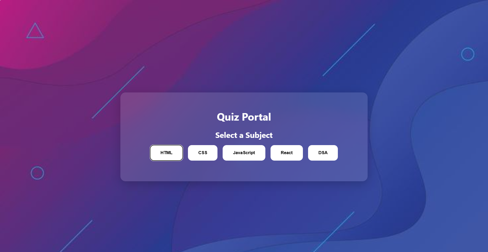
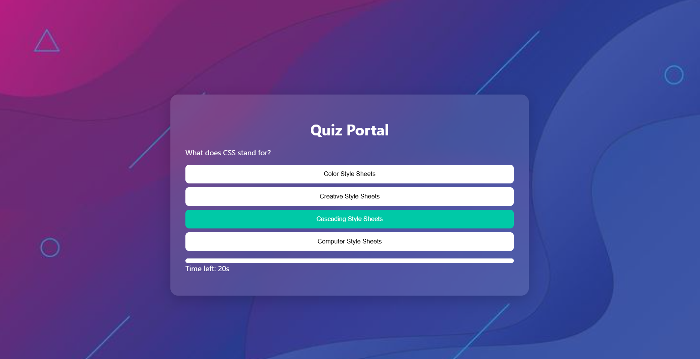
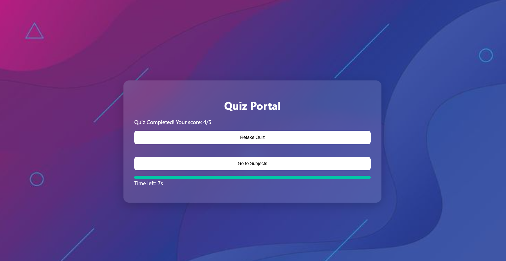

# 🧠 Quiz Portal

A fully responsive, client-side **Quiz Portal** built using **HTML, CSS, and JavaScript**.
Select a topic and challenge yourself with a timed 5-question multiple-choice quiz on HTML, CSS, JavaScript, React, or Data Structures & Algorithms (DSA).

---

## 🚀 Features

- 📚 5 Subjects to choose from: HTML, CSS, JavaScript, React, and DSA
- ❓ 5 Questions per quiz – all multiple choice
- 🧮 Score calculation out of 5
- 🔁 Retake quiz or choose a different subject after finishing
- 📱 Responsive UI for all screen sizes
- 🎨 Modern UI with smooth gradients and intuitive layout

---

## 📁 Project Structure

TIC_TAC_TOE/
├── img/
│   └── bck.jpeg
├── index.html
├── style.css
├── script.js
└── README.md

---

### 📌 Landing Page - Subject Selection

### ❓ Quiz in action

---

## 💻 Tech Stack

- **HTML5** – For creating the structure
- **CSS3** – For styling the UI
- **JavaScript** – For game logic

---

## 🧠 How it works?

- Choose one of the five subjects on the home screen.
- Each quiz has 5 multiple-choice questions.
- You get **30 seconds** to answer each question.
- At the end, your score out of 5 is displayed.
- Choose to **Retake** the quiz or **go back** to Subject Selection.
